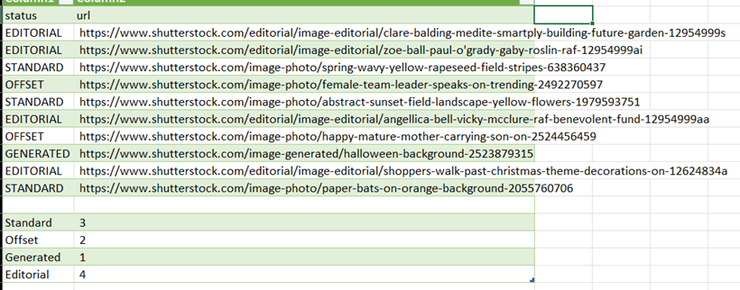

 [](LICENSE)
 []()
 []()


# 📸 Shutterstock Offset Detector

A Chrome Extension that automatically **categorizes Shutterstock image links** into  
**STANDARD**, **OFFSET**, **EDITORIAL**, and **AI-GENERATED** types.

It can:
- Parse individual links, IDs, or collection URLs 🧩  
- Open each link in Chrome tabs  
- Detect its true category *after the page loads* (using HTML markers)  
- Log all results into a single CSV file with summary counts  

---

## 🌟 Features

✅ **Automatic classification**
- Detects unique markers:
  - `offset_logo_black_background.png` → **OFFSET**
  - `image-editorial` → **EDITORIAL**
  - `ai-generated image formats` → **GENERATED**
  - Everything else → **STANDARD**

✅ **Supports**
- Plain IDs (`2524456459`)
- Full Shutterstock URLs
- Entire collection pages (`/catalog/collections/...`)

✅ **Outputs**
- Live summary in popup UI  
- Downloadable CSV log: `offset_check_history.csv`

✅ **No duplicates**
- Logs each image once, only after it’s opened and scanned  

---

## 🖼️ Screenshots

| Popup UI | Example CSV Output |
|-----------|-------------------|
|  |  |


---

## 🧩 Installation (Developer Mode)

1. Clone or download this repository  
   ```bash
   git clone https://github.com/yourusername/shutterstock-offset-detector.git
2. Open Chrome → Extensions → Manage Extensions
3. Enable Developer mode
4. Click “Load unpacked”
5. Select this project’s folder


⚙️ Usage

Open the extension popup
Paste:
Shutterstock IDs
Direct image links
Or a collection link
Click “OpenLink”

Tabs will open automatically
Each page will be classified in the background
Click Download to export your results as a CSV


---


Developed by [Azhar], [Iskandar]
Powered by Chrome Extensions (Manifest V3)
Inspired by the need to simplify Shutterstock link categorization.

